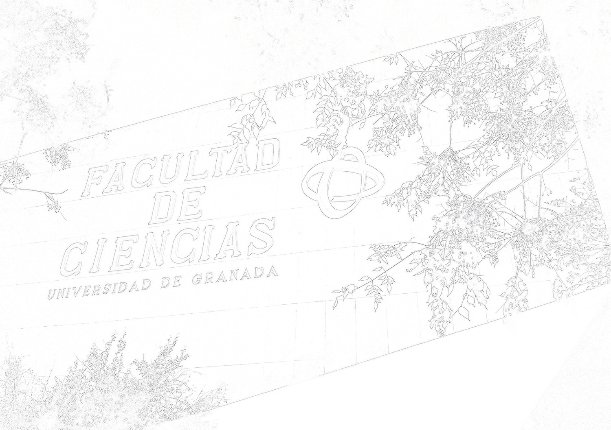

#Taller de LaTeX para alumnos de Grado en Matemáticas



[Pedro A. García Sánchez](http://www.ugr.es/local/pedro), <pedro@ugr.es>

***

##Documento sencillo

La estructura de un documento es la siguiente

```latex
\documentclass{...}

\begin{document}
...
\end{document}
```

***

## Cabecera o preámbulo

Entre `\documentclass` y `\begin{document}` ponemos declaraciones y paquetes que vamos a necesitar

```latex
\usepackage[utf8]{inputenc}
\usepackage[spanish]{babel}
\usepackage{enumerate}
\usepackage{graphicx}
\usepackage[hidelinks]{hyperref}
\usepackage[vmargin=2cm,hmargin=2cm]{geometry}

visualización de las cabeceras del documento
\title[Taller de \LaTeX]{Taller de \LaTeX\ para alumnos del Grado en Matemáticas}
\author[Los presentes]{Los asistentes a dicho curso}
\thanks{Agradecemos a la AMAT por organizar este curso}

\address{Facultad de Ciencias}
\email{alguno@ugr.es}
\renewcommand{\datename}{Fecha:}
\date{\today}
\renewcommand{\keywordsname}{Palabras clave}
\keywords{\LaTeX, taller software libre}
```

***

##Resumen, título y tabla de contenidos

###Resumen

```latex
\begin{abstract}
Esto es una prueba de cómo hacer algunas cosas en \LaTeX.
\end{abstract}
```

###Título
El título y datos de autores se visualiza con `\maketitle`

###Tabla de contenidos
Podemos añadir una tabla de contenidos con `\tableofcontents`

***

##Secciones

Podemos crear seccions (en un libro también capítulos y partes) con el comando `\section`. Éstas pueden contener subsecciones: `\subsection`, y subsubseciones. Finalmente tenemos párrafos, `\paragraph`, y subpárrafos


| Comando	| Nivel |
| --- | :----: |
|`\part`	| -1 |
|`\chapter`	| 0 |
|`\section`	| 1 |
|`\subsection` |	2 |
|`\subsubsection` |	3 |
|`\paragraph`	| 4 |
|`\subparagraph`	| 5 |

Véase <http://en.wikibooks.org/wiki/LaTeX/Document_Structure>

***

##Listas

Hay listas numeradas y sin numerar. Se pueden anidar, y el tipo de numeración cambia con la profundicad de anidamiento

```latex
\begin{enumerate}[1)]
\item Aquellas que van enumeradas.
	\begin{enumerate}
	\item \ldots que además se pueden anidar.
	\end{enumerate}

\item Aquellas sin enumerar:
\begin{itemize}
\item[$\diamond$] damos varios apartados,
\begin{itemize}
\item y podemos también anidar.
\end{itemize}
\end{itemize}
\end{enumerate}
```

***

##Tablas

Las tablas que presentamos aquí son muy sencillas, se pueden además unir celdas o separarlas

```latex
\begin{tabular}{lcr}
1 & 2 & 3 \\
Pepe & Juan & Manuel
\end{tabular}
```

O bien con bordes

```latex
\begin{tabular}{l||c|c|c|} \hline
Posición & 1 & 2 & 3 \\ \hline \hline
Nombre & Pepe & Juan & Manuel\\ \hline
\end{tabular}
```

***

##Tipos de letra

Tenemos varios tipos de letra y tamaños básicos

Comando | Tipo
--- | ---
`\textbf` | **negrita**
`\textit` | *itálica*
`\textsl` | helvética
`\texttt` | courier
`\textsc` | pequeñas Mayúsculas

 ... o bien podemos `\emph{enfatizar}` una `\textit{parte del texto \emph{dentro} de otro}`

***

##Fórmulas

Existen dos tipos de fórmulas
- En línea como por ejemplo `$x^2+1$` que produce $x^2+1$  
- En modo ventana o centrado: `$$x^2+1$$` que se ve como

$$x^2+1$$

Los delimitadores `$..$` se pueden substituir por `\(..\)` y
```
$$..$$
```
por
```
\[..\]
```
(entre otros, de hecho este último ofrece más funcionalidades como `\qedhere`)

***

##Entornos

```latex
\newenvironment{ejercicio}[1]{\textbf{Ejercicio número #1}}{\qed}
```

```LaTeX
\begin{ejercicio}{1}
Escribe esto con otras palabras.
\end{ejercicio}
```

De esta forma escribimos el contador de ejercicio de forma manual

Para automatizarlo, hacemos lo siguiente

```
\newcounter{ejer_num}
\setcounter{ejer_num}{1}
\newenvironment{ejer}{
  \textbf{Ejercicio \arabic{ejer_num}: \stepcounter{ejer_num}}
  \begin{itshape}
  }
  {\end{itshape}}
```

***

##Entornos predefinidos

Podemos numerar con la sección
```
\newtheorem{teorema}{Teorema}[section]
```
Y otros entornos con el contador que acabamos de crear

```
\newtheorem{nota}[teorema]{Aclaración}
```


```latex
\begin{teorema}\label{tonto}
Las ranas son verdes.
\end{teorema}
\begin{proof}
Así lo decía Aristóteles, y nosotros no vamos a llevarle la contraria.
\end{proof}
```
Luego podremos referenciar a este teorema como Teorema `\ref{tonto}`

***

##Figuras e imágenes

El paquete `graphicx` nos permite insertar gráficos con el comando `\includegraphics`

```
\includegraphics[width=2.5cm]{imagen.jpg}
```

Podemos también crear una figura con esa imágen

```latex
\begin{figure}
\includegraphics[width=3cm]{imagen.jpg}  
\caption{Algo que encontré por
\href{http://www3.interscience.wiley.com/journal/13087/home/ForAuthors.html}{ahí.}
}
\label{uno}
\end{figure}
```
***

##Indentación

Podemos escribir texto centrado con
```latex
\begin{center}
Texto a centrar.

Puede ser más de un párrafo.
\end{center}
```

Y desplazarlo a la derecha con `\hfill`

***

##La bibliografía

Para insertar la bibliografía se usa bien `bibtex` (que veremos más adelante) o el entorno `thebibliography`

```latex
\begin{thebibliography}{10}
\bibitem{lshort} Tobias Oetiker, Hubert Partl, Irene Hyna and Elisabeth Schlegl,
  The not so short introduction to \LaTeX2e,
    \href{http://www.ctan.org/tex-archive/info/lshort/english/lshort.pdf}{ctan.org}.
\end{thebibliography}
```
